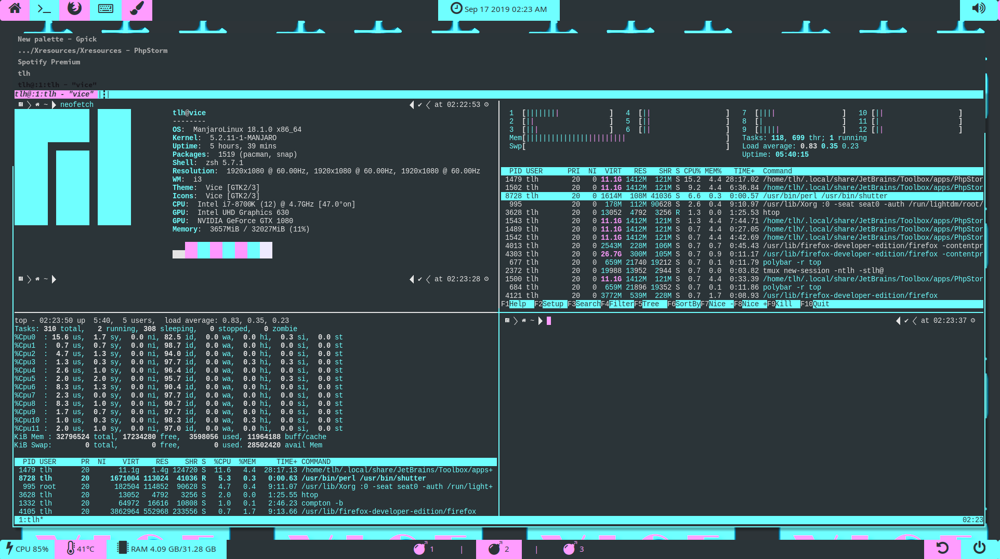
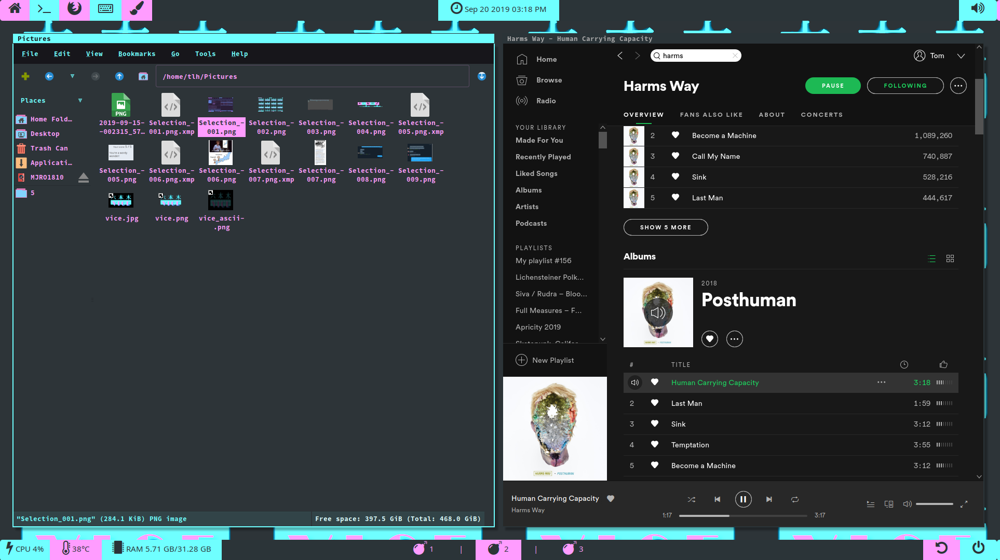

I have spent the last two years going from experimenting with Linux on virtual machines 
to old laptops and for the last year and half have used Linux exclusively for all of my
computing needs. Like many Linux users, I fell deeper and deeper into the 'minimalist'
aspects of my OS as I dug around at its center, eventually learning to script out my 
entire installation to restore my workstation after any one of my many experiments ended in 
tragedy. Then I found dotfiles and tiling window managers and fell right into the void. 

# Down Into the Dotfile Rabbithole

## Dotfiles
Because no one would ever want to read the exact evolution of Linux use I went through,
as it is almost a memetic trip down Linux-related subreddit trends and attitudes
(ironically a website I rarely use), let's cut to the chase and get go straight to dotfiles. 

**Dotfiles** are configuration files that are stored in your home directory, aka `~`, that
the various programs your machine loads uses to reset your preferred application settings
when that application is launched by you. They are generally 'hidden' by file managers 
because they _typically_ start with a '.' which you file manager hides but is easily
either by changing file manager settings or if using your terminal like a good Linux 
user by add `-h` to your `ls` command, ie `ls -ahl` which I have as an alias `alias ll="ls -ahl"`. 

**Awesome more control over my environment with easily accessed configuration files!**

This is a Unix-related thing, apparently this is also true for macOS users, but means 
that you have access to these files and can back them up using GitHub, GitLab 
or whatever VCS solution works for you. 

There are different options available for managing these files, because at install 
remembering where to copy them all just sounds like a hassle too far even for a 
seasoned rolling distribution user. You could script out your own solution, which 
offers the most control and individual configuration *or use one of scores of options
available via GitHub/GitLab*. 

##### Common Dotfile Managers
 - stow 
 

### Enter DotBro
I have scripted out my own solutions to my dotfiles, but its not worth another project 
to maintain for me at this time because the solution provided by dotbro covers my use 
case perfectly. 

**Dotbro** has automatic management and managed configuration abilities. I prefer 
managing my own (_for the most part_), which is done with a config.toml file that
lives in your dotfiles directory/git repo. 

#### Dotbro Pros v Cons
Pros:
    - Ease of reintegration following installation
    - takes care of system links for you, both making new ones and removing broken ones
    - easily configured with config.toml 
    - AUR package available 
    - I don't have to maintain the script, an awesome team is on top of it already
Cons
    - Manual mode cannot add entire directories, each file must be written into the 
    config's mapping section individually
    - Cannot see hidden files, within the repo the filename must not start with a period

## Becoming Master of the Dots
Nothing has advanced my understanding of how Linux works under the hood like exploring 
these seemingly arbitrary sets of configurations and getting them to play nicely with one 
another, my DE/WM and exploring the dotfiles others post on GitHub. It can be a tedious
process, but one worth exploring as properly configured work flows will more than make
up for time spent fiddling with dotfile configuration. 

### Exploring Other's Dotfiles the Right Way

Thanks to sites like GitHub, you can not only back up our dotfiles for use next time we
break our OS and need to reinstall, but also you have access to thousands of repositories 
of others doing the same thing that you can browse through for tips, tricks and ideas in 
setting up that perfect workstation. 

There are two ways of exploring dotfiles repos: one is to examine them and pull ideas from them
configuration at a time; the other is to simply copy the dotfiles of another user and try
to make it work. While there is a time and place for the latter, like learning Lua scripting
for Awesome WM, **it is generally always better to add in one configuration at a time**

By adding one configuration at a time, especially if it involves keybindings, gives you the chance to learn how
the change effects your system. At first this will probably go slow but as you do this 
you will gain an eye for the system as a whole and how its parts interact. You also make
the debugging process much easier on yourself, and have less of it, when you dotfiles 
are self-composed. 

This method also makes it considerably easier to customize the system to **your** needs,
which are likely very different than the person whom you are copying the configuration
from and distinct. Having broken my hands in various places working with heavy items as
an undergrad working at a pet food store, what is ergonomic for my tortured hands and 
what you find comfortable will obviously be different. 

### My Dotfiles 

**Here are some screenshots of what I did with the many possibilities offered by configuring my dotfiles.**

> The above is TMUX displaying within the Kitty Terminal Emulator. Both are styled and configured by 
> dotfiles stored in my Dotfiles Github Repo. 

> Using i3gaps, I have moved to using titling window managers recently. Also styled by dots!

> This is a portion of my Polybar toolbar, used to create the status bars on my window manager and replacing 
> the typically used i3status due to its features and abilities. 
>
>Each of the buttons is linked to three programs. They open depending on the mouse button you press. For instance
> if you click the keyboard with the left mouse it opens SpaceMacs, hit the middle it opens GEdit and the
> right button opens Webstorm  
