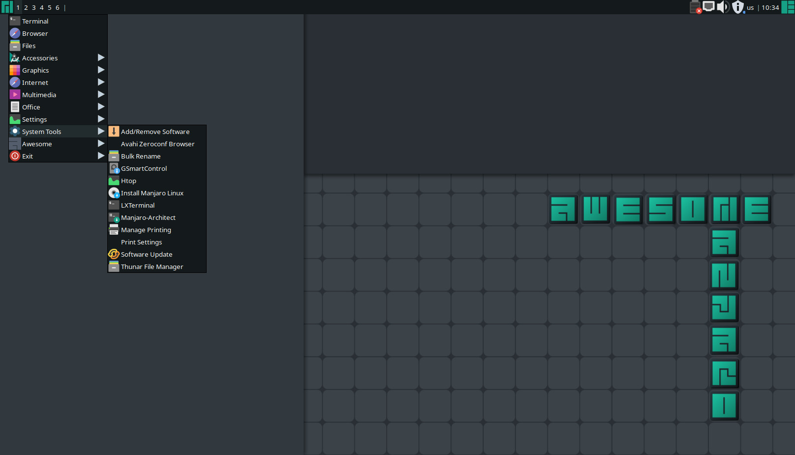
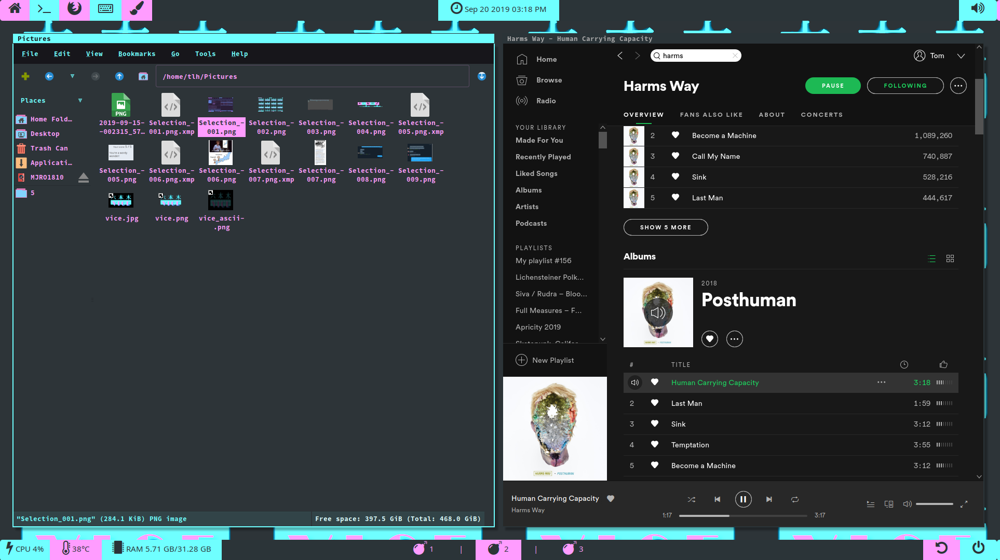

When using SpaceMacs recently, then especially finding TMux the answer to my terminal emulator issues, I 
started exploring the many possibilities opened up by using a tiling window manager. What is that? Its a 
program that replaces the window manager of your desktop environment with one that automatically handles
presenting you windows in a format that helps to streamline complicated workflows and can even eliminate 
the need for a mouse.

## Introduction

 My descent into the depths of Linux recently was more than just a trip into the depths of possibilities
opened by the configuration and standardization of my dotfiles, discussed in prior post, it included the 
exploration of the possibilities of tiling window managers. While there are several options available
I demonstrated and played around with, I am currently settled on a personalized i3gaps environment that 
uses XFCE (through Manjaro) as a means of benefitting for some of the functionality I would otherwise 
not have. Here's why:

## Why Not Another Linux Desktop Environment
I have used a number of DEs, or **Desktop Environment**, over the last two years and each one left me wanting something more. With Gnome,
I was unimpressed with its _Overview_ drop down and the animations always were a little buggy for me. 
With XFCE, I liked having the ability to make bars and its smaller footprint but found it had its own 
performance issues and especially in regards to configuration I hated the process of getting everything 
just write. I also played with KDE and plasma in LXQT, the former I had performance issues that considering 
the specs and relative new-but-not-too-new machine, was not related to hardware but due to but is much more
my lack of willingness to learn the quirks of KDE or Plasma. LXQT I found light and snappy, but not exactly
featureful enough or configurable as easily as the other options I began to explore instead. I had settled 
on Budgie for a long time, it was enough of a DE to handle most tasks really well but lacked the customization
options I wanted (like bars on all the windows). So I explored the alternatives that I could find and found
tiling window managers a suitable replacement. 

## Tiling Window Managers
While window managers are not complete DEs, they provide enough of a difference in desktop usage to make
them the next stop down the Linux abyss when you have exhausted the DE options available and are still not
satisfied. 

Tiling window managers answer for a lot of other issues than I expected actually, they draw windows that
hold the various programs you run while using your computer next to each other and dynamically resize windows 
according to a specific pattern as you call them to the screen. 

When programming websites, I often have a few screens open that I need to look at such as a terminal, my IDE and of course
a browser to view how the site looks and play with its functionality. I use three monitors with my desktop, 
which insulated me from needing to become alt-tab champion for a while but even still there are a lot of times
where I will loose track of windows or have to size them with a mouse at a greater expense of time than I 
need to quickly hit a couple key strokes and have them all displaying on screen. 

## The Options I Explored

I have explored several options so far in my use of tiling window managers, mostly i3gaps and AwesomeWM. Each has
a particular use, set of strengths and especially set of challenges in using it but either is a decent replacement 
for the overwhelming majority of tasks that I was looking for in tiling wms to improve my workflow in. 

### Awesome WM 

Awesome WM I expect to be what I turn into my primary WM in the future, but have as of yet not dug quite 
as deeply in as i3. Awesome provides the user with a set of rather nice options for managing each monitors 
lay out with icons available on screen and it has a right click menu that replaces the majority of need for 
additional system bars (cause let's face it, "start menus" are about the most useful part of them). It 
also has an ergonomic system of hotkeys and a useful one that shows all of your shortcuts `super + s`. The 
only issue that I have with it at present is I am not familiar enough yet with Lua scripting, which is what
the configuration file is written in, nor have a found a good way to manage my dotfiles in Awesome, though
stow promises use in this instance once I figure it out better. 

The Manjaro edition features a system menu on its bar and a pleasant series of tweaks from the Manjaro team
that I find especially helpful in using the Window Manager as well as a suite of preinstalled programs
that do not cause additional burden to the hardware but also help bridge the gap between Awesome and a 
typical installation with a full DE and its window manager. 

### i3gaps

 
 > The above picture above shows two windows open on my system. The margin between them is the gaps in i3gaps 
> as configured by my i3config file. The other gap is between the system bars and the windows, which 
> I like a little more pronounced to prevent visual bleed over. 
  
  
i3gaps is a forked version of i3wm that includes the option to put space between the tiled windows. Some 
users don't find this necessary but I find that without said gap, my eye is more easily lost on a window. It 
features a very simple configuration file that enables users to modify much of the system, including custom 
keybindings that can make using the system much faster. I have shortcuts for my browser, file manager and my 
terminal emulator as simple `super + Fx` that makes opening instances of these apps much faster than either 
rofi (system menu program) or the old fashion start bar ever made it. 

i3gaps, or i3wm in general, is not only easy to configure but has a lot of documentation and a lot of 
online support questions already addressed that make a lot of the harder parts of using the window manager
less intimidating or time consuming than doing so for Awesome WM, which instead requires the older and more
time consuming approach 'break it and see what makes it work again'. 

It is worth mentioning that i3 comes with a layout system that is very inuitive and easy to modify. One can
use windows in the traditional floating mode with a key press and mouse drag. It also provides a stacking 
layout mode in which programs take the "maximized" view except above the window are the other windows accessed
by keystrokes or mouse click or the tabbed mode that "tiling" implies. i3 offers less options than Awesome
in layouts, which is why I am preparing to switch to it in part (as well as even more available through extension
libraries) but i3 has provided a good proving ground with the present options available. 

Awesome  
 - has more window tiling modes 
    - offers tiling mode like BSPWM (tree like)
 - requires Lua 
 - less documentation 
 - better default bindings 
 - better manjaro defaults ;]
 - workspace system is a little more polished 
 - less examples to play with 
 - uses asynchronious XCB library instead of XLib
 
i3 
 - more configurable without additional knowledge or practice in new languages 
 - sane development cycle preventing bugs 
 - is used by a lot of people and therefore lots of options and ideas available via dotfiles on GitHub to 
 explore when customizing
 - comes with informative status bar by default 
 - less useful default shortcuts 
 - lots and lots of documentation and support online 
 - single workspace to tag 
 - layouts include stacking and tabbed layouts, with easily accessed floating mode
 - workspaces are little more of a program to configure and while older forms of the WM allowed the whole screen 
 to function as a workspace, that is available currently and guides on doing this are evading my detection. 
 

### My Choice 

The Window Manager I have settled on is i3, which I have installed via Manjaro and comes with a backend suite 
of programs from XFCE and LXDE that the Manjaro team includes with the Community ISO or installed via Manjaro 
Architect. 
 
 #### Why Manjaro + i3
 
 While it would not take much more time to install i3 on Arch, there is a setup time and attention span 
 gap that strikes me here with an Arch install that is related to my experimentation with Linux and diving
 deeper into its internals. I break my installation **a lot**. 
 
 This means that going through the Arch installation is a longer hassle than it is worth. I get the same
 control from Manjaro Architect without needing to keep my laptop open and trying to copy specific commands
 from Arch's wiki while going through the install. 
 
 I also like that Manjaro comes with an XFCE+LXDE backend that handles the basic things I would not have
 remembered to add on (or add to my Ansible playbook for running post install) like Nitrogen, LXAppearance for changing 
 GTK3 themes and a suite of other programs that going through the motions of deducing right now is something
 I do not want to do when there are plenty of web development related tasks I must do. 
 
 Also Manjaro editions of Awesome and i3 both come with a really nice suite of other add-ins and configuration
 changes I like a lot. While I isolate them in Awesome I will need to use it but even in the case of i3 where
 I have incorporated most of the Manjaro fixes I like into my overall dotfile configurations, I still 
 prefer the Manjaro Architect installation even if in other situations (like my hypervisor) using Arch's 
 even more minimal base, I still like Manjaro for a quick workstation reinstallation. 
 
 ## Performance Gains
 I have had a number of performance gains recently since switching to i3gaps as my full time WM. They are
 not all objective or subjective, and some might even be adaptations from using the WM and adapting to 
 its flow, but they have made the subjective experience of using i3 much better than any of the major DEs I 
 have used. 

### Objective Differences
| Performance | XFCE | Tiling WM | 
| --- | ---| ---|
| RAM at baseline | 3GB minimum | 823 MB |
| CPU at baseline | ~15% | 2-5% |
| RAM under load | 8-15GB | 4-6GB | 
| CPU under load | ~23% | ~2-22% |
**Notice**: that my CPU seems to be utilized more effectively, even after I adjusted report times to be the same. 

The obvious difference between Manjaro XFCE and i3 is that the Tiling WM made my hardware overhead lower both
when nothing was open at all and when I was running a typical workload. 

### Subjective Differences
#### Workflow, Workflow, Workflow
Like most of the buzzwords I have seen popping up unrelated to web development particularly, I thought nothing of **workflow** when I saw it referenced about the many, many 
mentions of it in my exploration of various web technologies and Linux help forms. Then when I noticed that
the flow of my development and a lot of other tasks I use my computers for had suddenly gotten much more 
_ergonomic_ I understood why it was even discussed. 

**Workflow** is what it sounds like, the process and series of events that compose you accomplishing a 
specific task. For instance, my workflow when developing web applications is to write the code in an IDE
or editor (yay Spacemacs) as a run a terminal application to provide a development server that I then access
via my browser of choice (generally Firefox Developer Edition, Chromium or Basilisk).

While three screens was typically fine for my workflow, there were times that I found myself loosing windows 
and I saw the utility of workspaces in KDE and Gnome but never had a good experience with them and the 
bloated amount of processes and RAM usage of those systems to fully implement them (as well as no reliable 
way of backing them up or reproducing them upon installation). 

In the case of i3, the low overhead and options for layout configurations like tabbed or stacking meant
I have been able to have windows open on different screens or virtual screens that house various programs
related to a specific task. I would prefer the KDE or Gnome+configuration like system of entirely different
set of all three screens (each monitor) but using the screens as I am at present has provided me with 
the ability to have everything open, be less concerned with checking my system status (despite the more 
reliable means I use presently in my bottom polybar to show me those stats) and get tasks accomplished much 
more quickly and with less distractions that any previous method I used allowed.  

## Mouse Free Livestyle

I did not opt to remove my mouse from my system or other overly dramatic expression of needing one less. 
There are certain tasks that lend themselves to using a mouse and I am not the kind of person who introduces
unnecessary deprivation to my workflow I do not need to. Though you could go without a mouse with i3 or Awesome.

The keybindings by default of both allow for almost any desktop related task to be without a mouse. This is 
awesome for use if you absolutely hate using a touch on your laptop (I use Lenovo Thinkpads exclusively so this is not a problem even on laptops for me)
and a great way to force yourself to use more terminal based applications to perform various tasks, which considering
the speed with which those programs often work means I often prefer them to the GUI alternatives, something true of issuing 
terminal commands vs. GUI wrappers as well once one knows the right programs.

I have ended up barely using my mouse, as a quick set of key strikes is way faster than moving my hand to the mouse, clicking things, following menus, etc. 
But I am not removing it from my workspace, as I do need to use GUIs+mouse-clicks for things like picture editing 
and because if I need the mouse, its better attached. After all, improving my workflow and making arranging my desktop 
faster have been the boons of using a tiling window manager for me, why would I want the potential slowdown of
lacking a potentially important tool?

PS I also use the mouse and several icons on my top bar to open different often used applications, utilizing each mouse button
to open a specific program, so I definitely am not throwing out my mouse now. 

#### Bonus: Other Window Managers 
These are window managers I have experience with, or don't have but want to explore, with some quick notes
about them. I might expand this into an article proper, but regardless you may find my notes on these 
helpful in considering your options. 

- [ ] IceWM - a floating window manager said to be minimal and light that also has a suite of themes made
to use with it to simplify adoption
- [x] Openbox - a floating window manager that is easy to use and familiar but lacks any other features that
come with it. Nice system to configure but still features the frustrations I had with the default WMs of the 
DEs I have used. 
- [ ] Xmonad - a Haskell based WM with a lot of contributed modules and evidently a smooth experience in 
multi-monitor applications. 
- [ ] dwm - part of the suckless family of all things Linux super nerdy. Has a code base that encourages 
modification and a lot of well thought out shortcuts. 
- [ ] spectrwm - like Xmonad but with plaintext configuration
- [ ] herbstluftwm - tiling window manager that uses bash shell for configuration and features live reloading 
- [x] bspwm - tree like tiling manager that is ergonomic in its placement of windows (along a fibonocci sequence)
- [ ] JWM - Joe's Window Manager works with other libraries and is both lightweight and C-based
- [ ] Qtile - Lightweight and easily scripted, this tiling window manager also has comprehensive docs that
make its adoption and customization easier than otherwise would be possible. 